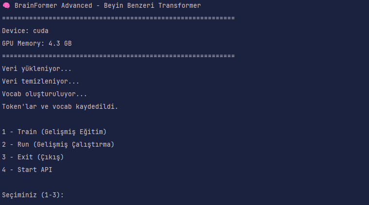

# MoE Catalyst

**MoE Catalyst** is a lightweight, modular **Mixture of Experts (MoE)** framework designed to accelerate experimentation with expert routing and scalable LLM architectures.

# Catalyst
Beynin sağ ve sol yarım küresini taklit eden, hafif, hızlı ve optimize edilmiş bir LLM.



## Özellikler
- **Hybrid Brain Simulation**: Sağ yarım küre → hayal gücü yüksek yanıtlar, sol yarım küre → mantıksal yanıtlar
- **Short-Term & Long-Term Memory**: Bağlamı koruyan hafıza sistemi
- **Mixture of Experts (MoE)**: Dinamik olarak doğru "uzmanı" seçer
- **FlashAttention v2** & CUDA Graph optimizasyonu: Minimum gecikme
- **Tiktoken tabanlı özel tokenizer**
- **CUDA uyumlu**
- **TorchMetrics** ile performans takibi
- **Mobil + Web arayüz** ve API desteği

## Kurulum
```bash
git clone https://github.com/kullaniciadi/catalyst.git
cd catalyst
pip install -r requirements.txt
```

MONITORING: tensorboard --logdir=logs


